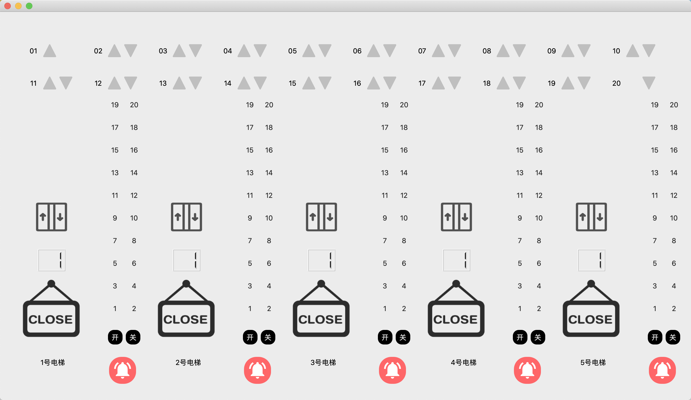

# 进程管理——电梯调度系统

## 项目目的
- 通过控制电梯调度，实现操作系统调度过程
- 学习特定环境下多线程编程方法
- 学习调度算法

## 开发环境
- 开发平台: MacOS 10.15、Windows 10
- 开发语言: Python3.9
- 开发工具: PyCharm

## 项目介绍
### 基本任务
基于线程思想，编写一个电梯调度程序，完成20层、五部电梯互联的楼房的电梯系统调度。

### 功能描述
- 电梯包括基础功能按键:数字键、开关门、上下行、报警
- 数码显示器显示电梯所在楼层
- 每层楼有按钮控制电梯
- 所有电梯初始在第一层

## 项目设计

### 用户界面设计
本项目使用PyQt5图形库作为UI框架，设计了一个主窗口，多个子组件，组件构成如下:
- 电梯内部
  - 20个楼层的按钮
  - 开门、关门按钮
  - 警报器按钮
- 电梯外部
  - 楼层编号
  - 第1-19层楼有上楼按钮
  - 第2-20层楼有下楼按钮
- 电梯界面
  - 电梯编号
  - 开门/关门/损坏状态
  - 电梯所在楼层LED显示
  - 静止/上楼/下楼状态

### 


### 调度算法设计

本项目采用LOOK算法来对电梯运行进行调度。
#### 算法介绍:
LOOK算法与SCAN算法基本思想相同，考虑两个运行方向上的请求。与SCAN算法不同的是，LOOK算法会查看运行方向前方是否发起请求，然后一直向前运行，到发起请求的最前方便停止，不一定需要运行到该方向上的终点，然后查看有没有相反方向上发起的请求：如果有，便反向运动；如果没有，便停在原地等待请求。

#### 项目实现:
本项目将调度算法分为两个主要部分，即外电梯调度（对应电梯外按钮事件）和内电梯调度（对应电梯内按钮事件）。

|函数|internal_dispatch()| external_dispatch()   |update() |
|:----:|:----:|:----:|:-----|
|**说明** |内电梯调度   | 外电梯调度   |每秒更新 |

|成员|message_front| message_reverse  |message_other |
|:----:|:----:|:----:|:----:|
|**说明** |同向运行消息队列   | 反向运行消息队列  |其他消息队列 |

- 内电梯调度:

  采用LOOK算法，如电梯在5楼，正向上运行，此时有7楼向上、2楼向上发起请求，则先到达7楼装载乘客，处理请求，再到达2楼装载乘客，处理请求。

- 外电梯调度:

  计算所有五部电梯中处理请求所经过楼层，选出其中最少的作为最优解，安排该电梯处理乘客请求。

## 项目部署与运行

首先克隆本项目到本地并进入项目文件夹

```bash
git clone https://github.com/potassiummmm/Elevator-Dispatching 
cd Elevator-Dispatching
```


安装依赖
```bash
pip3 install -r requirements.txt
```


然后运行本项目
```bash
python3 main.py
```